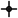
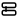

<div align="center">

# 4DoF Vision Robotic Pen Sorting

[](LICENSE)
[](#prerequisites)
[](#dependencies)
[](#object-detection)
[](#calibration)
[](https://github.com/Anirudhpro/4DoF_vision_robotic_pen_sorting/commits/main)
[](https://github.com/Anirudhpro/4DoF_vision_robotic_pen_sorting/issues)
[](https://github.com/Anirudhpro/4DoF_vision_robotic_pen_sorting/network)
[](https://github.com/Anirudhpro/4DoF_vision_robotic_pen_sorting/stargazers)

*Using Visual Intelligence and Motion Planning to Enable Complex Object Manipulation with a 4 DoF Robotics Arm*

</div>

---

## Project Description

This project demonstrates how cost-effective 4 DoF robotic arms can perform manipulation tasks typically requiring expensive 6 DoF systems by leveraging **visual intelligence** and **intelligent motion planning**. The system uses a custom-trained YOLOv8 Oriented Bounding Box (OBB) model to detect writing utensils, converts pixel coordinates into real-world robot coordinates through precise calibration, and executes sophisticated pick-and-place operations.

### Key Features & Technologies

**Computer Vision Pipeline**:
- Custom YOLOv8 OBB model trained on 330 annotated writing utensil images
- Real-time oriented bounding box detection with confidence thresholding (≥0.7)
- HSV/LAB color classification for sorting (blue, red, green, grayscale)
- Region-of-Interest filtering to eliminate clutter

**Calibration & Coordinate Transformation**:
- Checkerboard-based intrinsic calibration (Zhang's method) with 209 board captures
- ArUco-based extrinsic calibration for world alignment
- Precise pixel → camera → ArUco plane → robot coordinate transformation
- Automatic coordinate validation with safety gates

**Intelligent Motion Planning**:
- **STANDARD Motion**: Perpendicular left-offset grasp for low misalignment angles (<45°)
- **COMPLEX Motion**: Sweep-based reorientation for high misalignment angles (≥45°)
- Foam-assisted gripping with reduced closure to prevent object expulsion
- Color-based routing to designated drop-off zones

**Visualization & Debugging**:
- Dual UI: OpenCV real-time overlay + interactive Matplotlib workspace visualization
- Live coordinate display (pixel, camera-relative, robot coordinates)
- Motion preview with waypoint visualization
- Comprehensive session logging with MP4 recording and timestamped snapshots

**Why These Technologies?**:
- **YOLOv8 OBB**: Provides orientation information crucial for grasp planning
- **OpenCV**: Robust computer vision library with excellent ArUco support
- **Matplotlib**: Enables precise geometric visualization for debugging
- **Serial JSON**: Simple, reliable robot communication protocol
- **Python**: Rapid prototyping with rich scientific computing ecosystem

### Challenges Solved & Future Improvements

**Challenges Addressed**:
- Mechanical limitations of 4 DoF systems through intelligent software
- Precise coordinate transformation with consumer-grade hardware
- Real-time perception and decision making for autonomous operation
- Robust handling of various pen orientations and colors

**Future Enhancements**:
- Temporal smoothing of OBB angles over 3-5 frames
- Self-calibration via robot motion to known tag poses
- Global shutter camera upgrade for improved accuracy
- Adaptive sweep parameters based on object properties

<!-- Research documentation reference removed -->

---

<!-- Authors and contact information removed -->

---
## Table of Contents

-  [Project Description](#project-description)
-  [Installation & Prerequisites](#system-requirements)
-  [Calibration Workflow](#calibration-workflow)
-  [Running the System](#running-the-system)
-  [Usage Instructions & Examples](#usage-instructions--examples)
-  [Research Methodology & Results](#research-methodology--results)
-  [Citation](#citation)
-  [Tests](#tests)
### System Requirements

- **Python**: 3.10+ (recommended)
- **Operating System**: macOS/Linux (tested on macOS)
- **Hardware**: 
  - Camera accessible by OpenCV (USB webcam recommended)
  - RoArm-M2-S 4 DoF robotic arm with serial interface
  - Serial device path (e.g., `/dev/tty.usbserial-XXXX` on macOS)

### Dependencies

Install the complete environment:

```bash

<div align="center">

# 4DoF Robotic Pen Sorting — Vision‑Guided

[](#requirements)
[](#requirements)

</div>

Short: detects pens with a YOLOv8 OBB model, converts detections to robot coordinates via ArUco calibration, and runs pick/place motions on a 4‑DoF RoArm.

---

## Quick start

1) Install dependencies

```bash
python -m venv .venv
source .venv/bin/activate
pip install -r requirements.txt
```

2) Create `config.json` (example)

```json
{
    "serial_port": "/dev/tty.usbserial-XXXX",
    "robot_tag_xyz": [300, 0, -57]
}
```

3) Calibrate camera (one-time)

- Put 100+ checkerboard images in `CalibrationPictures/`
- Run:

```bash
python camera_calibrate.py
```

4) Capture ArUco pose (one-time)

```bash
python aruco_pose.py
```

5) Run the system

```bash
python camera_stream.py <serial_port> [logs_directory]
# or full pipeline
python full_run.py
```

---

## Files you will use

- `camera_stream.py` — real-time detection + optional robot commands
- `camera_capture.py` — capture images for calibration/dataset
- `camera_calibrate.py` — intrinsic calibration (checkerboard)
- `aruco_pose.py` — ArUco extrinsic/world alignment
- `full_run.py` — run the full pipeline
- `RoArm/serial_simple_ctrl.py` — serial robot utility

---

## Configuration

- `serial_port`: path to robot serial port
- `robot_tag_xyz`: arm pose relative to the printed ArUco tag (pre-calibration), in mm

## Tests

- Unit tests:

```bash
python test_pixel_conversion.py
python test_coordinates.py
```

- Integration (no robot):

```bash
python camera_stream.py --mock-robot ResearchDataset
```

---

Notes:

- Icons are in `assets/icons/` and referenced relatively so they render on GitHub.
- This README focuses on practical usage; detailed research notes were moved out of the main README.

---

License: see `LICENSE` file.
**Output Format** (`aruco_reference.json`):
```json
{
  "camera_matrix": [[fx, 0, cx], [0, fy, cy], [0, 0, 1]],
  "dist_coeffs": [k1, k2, p1, p2, k3],
  "rvec": [[rx], [ry], [rz]],
  "tvec": [[tx], [ty], [tz]]
}
```

**Troubleshooting**:
- **No marker detected**: Check lighting, tag size, print quality
- **Unstable pose**: Ensure rigid mounting, avoid reflections
- **Poor accuracy**: Verify tag dimensions, improve lighting

---

## Running the System

### Quick Start (Direct Execution)

For immediate testing with existing calibration:

```bash
python camera_stream.py <serial_port> [logs_directory]

# Example:
python camera_stream.py /dev/tty.usbserial-123 ResearchDataset
```

**Arguments**:
- `<serial_port>` (required): Robot serial device path
- `[logs_directory]` (optional): Session data storage (default: `ResearchDataset`)

### Orchestrated Execution (Full Pipeline)

For complete automated workflow:

```bash
# Short mode - skip calibration steps
python full_run.py short

# Full mode - complete pipeline
python full_run.py
```

**Full Pipeline Stages**:

1. **Serial Sanity Check** (`RoArm/serial_simple_ctrl.py`)
   - Tests robot communication
   - Executes predefined motion sequence
   - Validates serial interface

2. **Image Capture** (`camera_capture.py`)
   - Interactive capture interface
   - Saves images to `Aruco/` folder
   - SPACE to capture, 'q' to quit

3. **ArUco Management**
   - User selects best calibration image
   - Renames to `aruco_calibration.jpg`
   - Cleans up unused images

4. **Pose Estimation** (`aruco_pose.py`)
   - Processes selected calibration image
   - Generates `aruco_reference.json`
   - Creates pose visualization

5. **Live Stream** (`camera_stream.py`)
   - Launches main detection pipeline
   - Begins autonomous operation

### User Interface & Controls

**OpenCV Window ("Pen Detection")**:
- **SPACE**: Trigger motion for current detections
- **u/U**: Toggle AUTO mode (automatic triggering)
- **p**: Toggle plot overlay in video window
- **v**: Toggle separate Matplotlib visualization window
- **q**: Quit application

**Matplotlib Visualization Window**:
- Real-time robot coordinate display
- Motion preview with waypoints
- Geometric debugging information
- Same key bindings as OpenCV window

**Visual Feedback**:
- Blue oriented bounding boxes around detected objects
- Yellow dots at pen tips
- Coordinate information overlay
- Motion branch indicators (STANDARD/COMPLEX)
- Color classification labels

---

## Usage (short)

- Run `camera_stream.py` to start detection and optional robot control.
- Use `--mock-robot` for local testing without hardware.
- Use `camera_calibrate.py` and `aruco_pose.py` for calibration setup (one-time).

    plot_pen_geometry(ax, detection_data['center'], detection_data['tips'])
    
    # Visualize motion planning
    if detection_data['motion_type'] == 'STANDARD':
        plot_offset_candidates(ax, detection_data['offset_candidates'])
    else:  # COMPLEX
        plot_sweep_waypoints(ax, detection_data['sweep_path'])
    
    # Add coordinate annotations
    annotate_coordinates(ax, detection_data)
    
    return fig
```

---
## Citation

If you use this work in your research, please cite:

**APA Format**:
```
Rangarajan, A., & Bianchini, B. (2025). Using Visual Intelligence and Motion Planning to Enable Complex Object Manipulation with a 4 DoF Robotics Arm. GitHub. https://github.com/Anirudhpro/4DoF_vision_robotic_pen_sorting
```

**BibTeX**:
```bibtex
@misc{rangarajan2025visual,
  title={Using Visual Intelligence and Motion Planning to Enable Complex Object Manipulation with a 4 DoF Robotics Arm},
  author={Rangarajan, Anirudh and Bianchini, Bibit},
  year={2025},
  publisher={GitHub},
  howpublished={\url{https://github.com/Anirudhpro/4DoF_vision_robotic_pen_sorting}},
  note={Research project demonstrating cost-effective robotic manipulation through computer vision}
<!-- Contributing and contribution-guideline content removed -->


##  Tests

###  Unit Tests

Run the existing test suite:

```bash
# Coordinate transformation validation
python test_pixel_conversion.py

# Geometric calculation verification  
python test_coordinates.py
```

###  Integration Tests

**Calibration Validation**:
```bash
# Test calibration pipeline
python camera_calibrate.py  # Verify checkerboard detection
python aruco_pose.py        # Validate pose estimation
```

**System Integration**:
```bash
# Full system test (without robot)
python camera_stream.py --mock-robot ResearchDataset

# Robot communication test
python RoArm/serial_simple_ctrl.py /dev/tty.usbserial-XXX
```

###  Testing Your Setup

**Hardware Validation Checklist**:
- [ ] Camera produces clear, stable images
- [ ] Checkerboard detection finds all corners
- [ ] ArUco tag detected with stable pose
- [ ] Robot responds to serial commands
- [ ] Coordinate transformations within 5mm accuracy

**Software Validation Checklist**:
- [ ] All dependencies install without errors
- [ ] YOLO model loads and runs inference
- [ ] Matplotlib visualization displays correctly
- [ ] Session logging creates proper directory structure
- [ ] Configuration file parsed successfully

---

<!-- Star section removed -->
